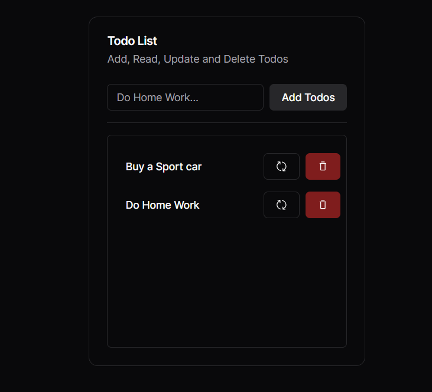

.

## About
This is a C.R.U.D app created with mockapi.io, Each api is stored in mockapi
## Getting Started

First, run the development server:

```bash
npm run dev
# or
yarn dev
# or
pnpm dev
```

Open [http://localhost:3000](http://localhost:3000) with your browser to see the result.

You can start editing the page by modifying `app/page.tsx`. The page auto-updates as you edit the file.
 - your feedback and contributions are welcome!

